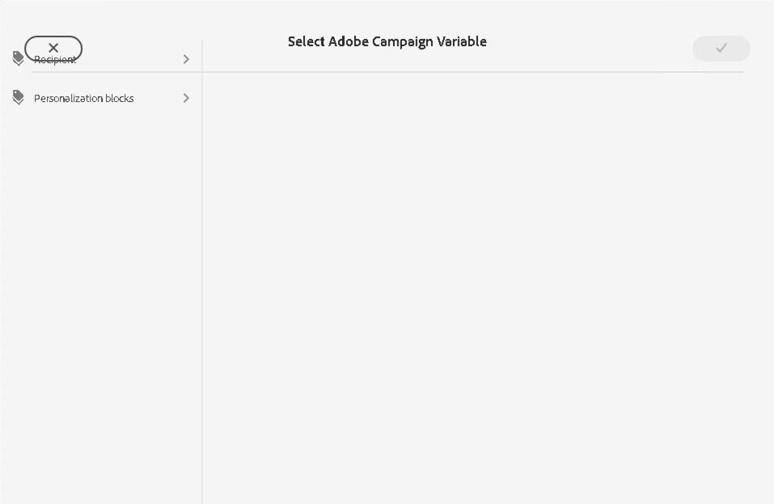
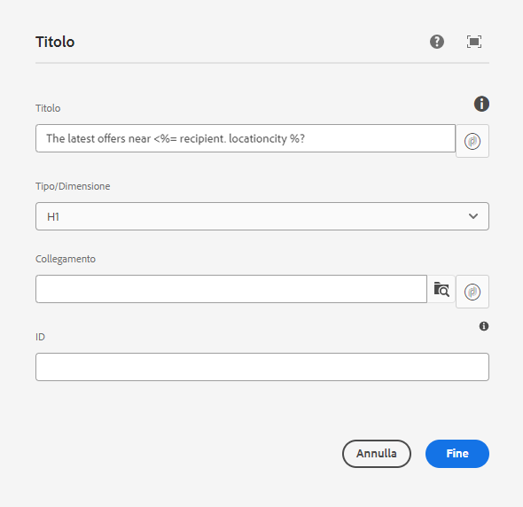

# Variabili di Campaign {#campaign-variables}

Utilizza le variabili di Campaign per comporre contenuti e-mail personalizzati. Le variabili di Campaign fungono da segnaposto per i valori di Adobe Campaign che puoi inserire nel contenuto dei messaggi e-mail. Quando il contenuto viene inviato tramite Adobe Campaign, Campaign sostituisce tali variabili con il contenuto personalizzato del destinatario.

## Utilizzo {#usage}

I componenti core E-mail rendono le variabili di Campaign facilmente accessibili tramite il pulsante di personalizzazione che si trova accanto ai campi di testo più comuni. Quando viene premuto, si apre una finestra di dialogo dalla quale è possibile selezionare un campo di personalizzazione.

L’elenco dei campi di personalizzazione disponibili è sincronizzato con l’istanza di Adobe Campaign. I campi vengono gestiti in Adobe Campaign nello schema `nms:seedMember`. Tutti i campi in `nms:seedMember` devono essere presenti anche nella tabella dei destinatari.

## Finestra di dialogo Seleziona variabile di Adobe Campaign {#dialog}

La finestra di dialogo Seleziona variabile di Adobe Campaign è disponibile in molte finestre di dialogo di modifica dei componenti core E-mail. Per utilizzarla, fai clic sull’icona **Seleziona variabile di Adobe Campaign** accanto al campo applicabile. Questa icona può assumere due forme.

Entrambe consentono di aprire la finestra di dialogo **Seleziona variabile di Adobe Campaign**.

Utilizza la vista a colonne per individuare la variabile da inserire. Quando si fa clic su un nodo in una colonna, i relativi elementi secondari vengono visualizzati in una nuova colonna a destra. In questo modo puoi navigare nella struttura del contenuto delle variabili.

Seleziona la variabile da inserire, quindi fai clic sul segno di spunta in alto a destra nella finestra di dialogo.

La variabile viene quindi inserita nel campo della finestra di dialogo per la modifica del componente core E-mail.

Fai clic sulla X in alto a sinistra nella finestra di dialogo in qualsiasi momento per annullare e chiudere la finestra di dialogo.
